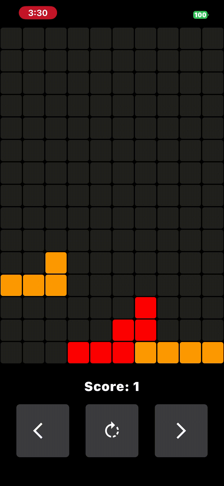
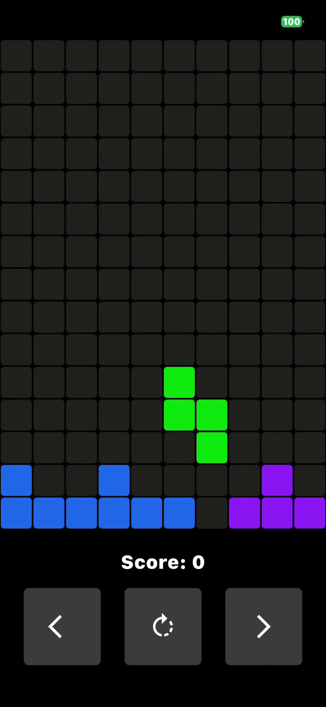
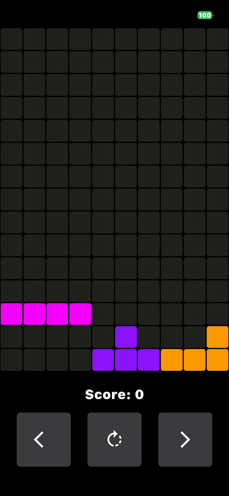
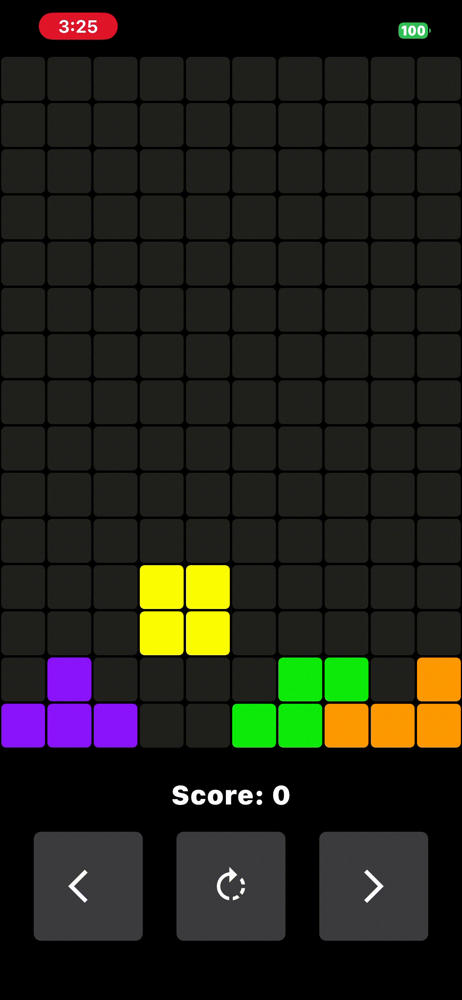
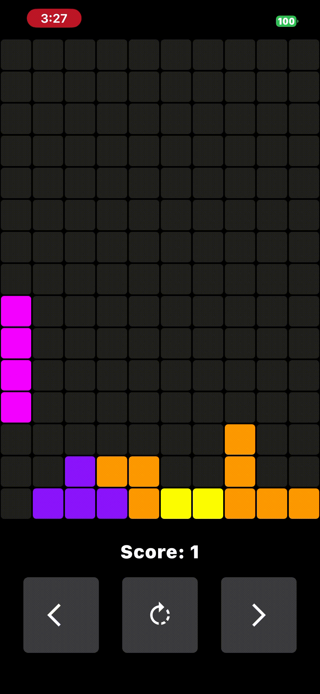
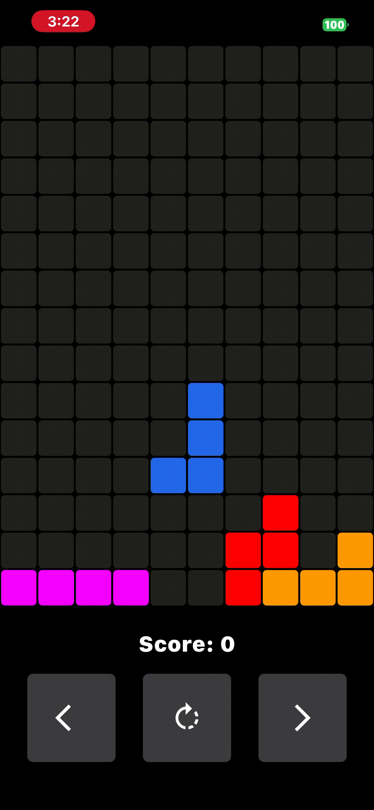
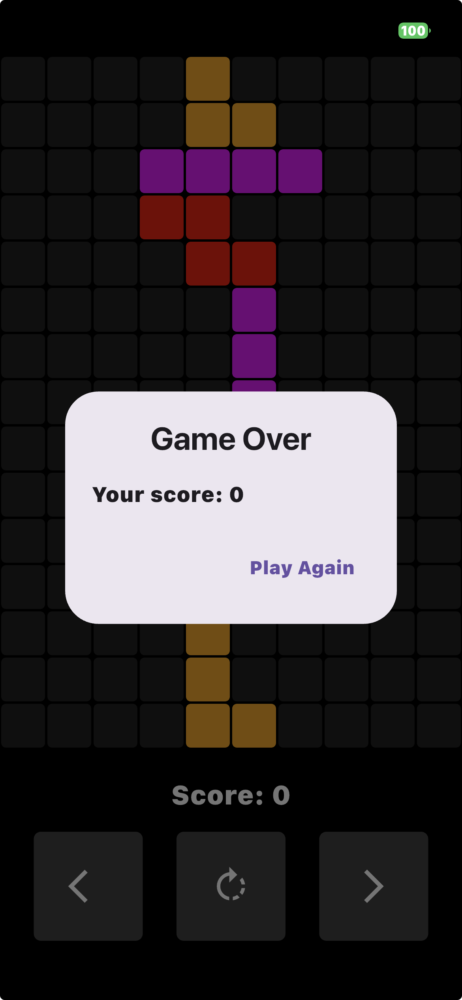

# Tetris
An iOS Tetris game. Made it by Following Mitch Koko's tutorial: https://www.youtube.com/watch?v=4sCSJW3hamE 
This app can only be run and tested on a developer's device or simulator. It is not available on the App Store.

## Features
### 1. Classic Tetris gameplay
One can move and rotate the pieces, and clear rows by filling them up. The game ends when the pieces stack up to the top of the board.

### 2. Multiple clear effects (heart, smoke, bubble, cloud, bird, particle)
1. **Heart clear effect**

2. **Smoke clear effect**

3. **Bubble clear effect**

4. **Cloud clear effect**

5. **Bird clear effect**

6. **Particle clear effect**

### 3. Game over message
